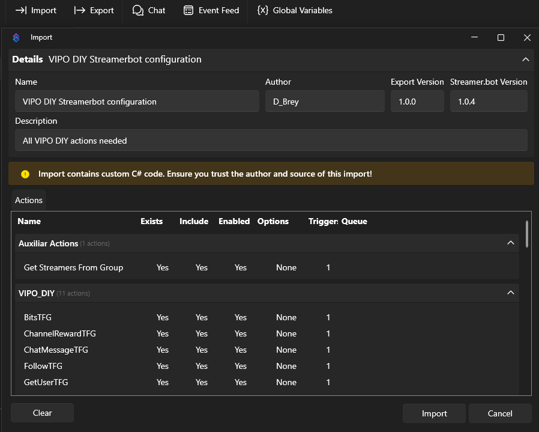
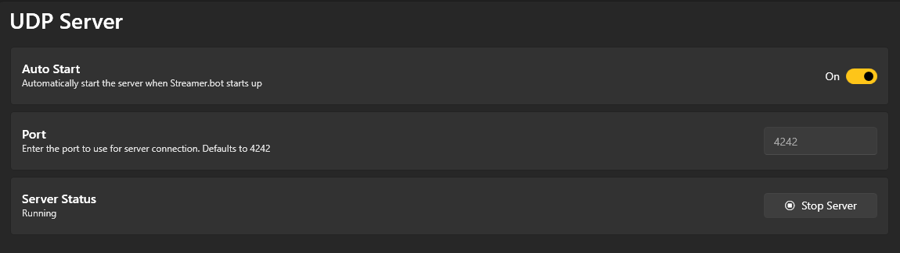
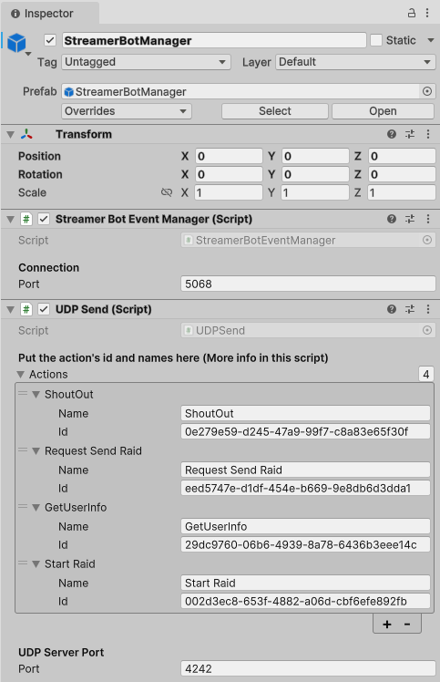
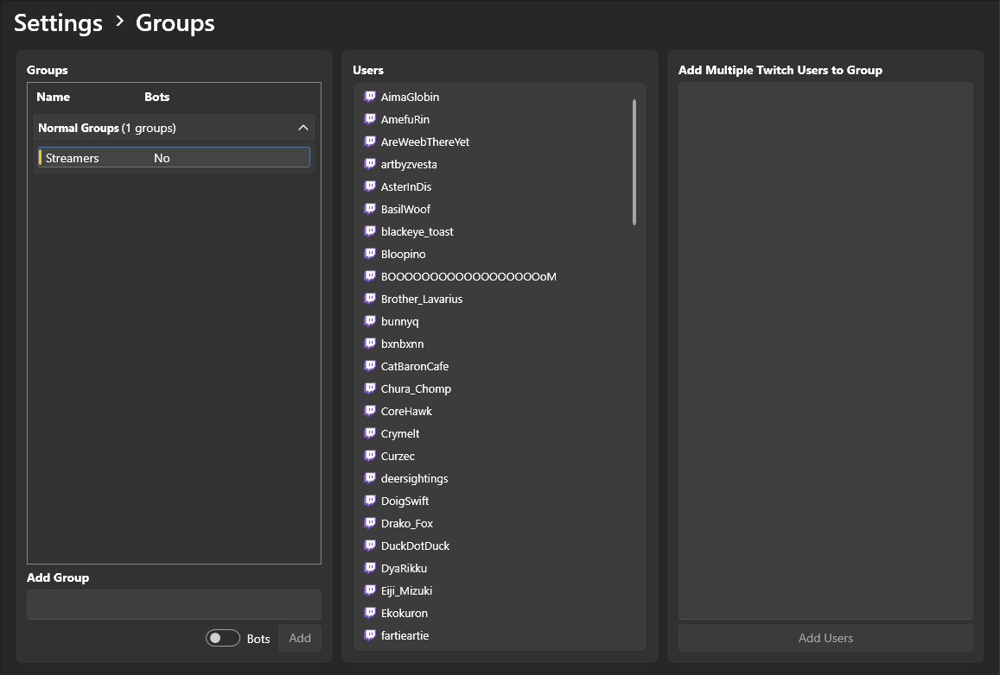

VIPO Do It Yourself is a Unity template project with everything you need to make your VIPO overlay!

What is a VIPO?
===========

VIPO stands for "Virtual Interactive Puppet Overlay", which is a type of VTuber. Usually, you control a character as a puppet and your viewers can interact with your overlay through different Twitch events like: Chat messages and commands, bits, subscriptions... 

A VIPO can be made with any game engine, there are already some VTubers that use Unreal Engine, Unity and even Godot! Some great examples are:

- [DoigSwift](https://www.twitch.tv/doigswift)

- [ReneRightHere](https://www.twitch.tv/renerighthere)

- [Drako_Fox](https://www.twitch.tv/drako_fox)

What can I do with VIPO DIY?
----------------

Although Twitch offers different means to access to Twitch events, they can be quite complicated for a beginner. VIPO DIY with the help of Streamer.bot, we register most Twitch events and transform them into data that the user can manage to do whatever you want.

Currently, VIPO DIY can register Chat Messages, Commands, Twitch Rewards, Bits, Subscription and Gift Subscription, Raids and Follows.

Installing Streamer.bot and Spout
----------------
To install the project it is necessary to have Streamer.bot which you can dowload on its [website](https://streamer.bot). It's also necessary to download the plugin of Spout for OBS Studio in this [website](https://knowledge.offworld.live/en/articles/5059810-spout-plugin-for-obs-studio) following the instructions. Once Streamer.bot is downloaded, you need to log in with your Twitch account in order to receive the channel events.

HOW TO IMPORT ACTIONS AND DO TESTING?
----------------
In order to import the actions, the string inside the file **"VIPO DIY Streamerbot configuration"** in the folder **"StreamerBot Stuff"** needs to be copied. Once inserted the string in the window that Streamer.bot provides, it should change to the next image.

Select **"Import"** and the actions will be imported.

To check the performance of an action, in the section of **"Triggers"** there will be certain triggers to activate if right clicked on it **"Test Trigger"** is activated.

How to activate the UDP server in Streamer.Bot
----------------
In the Streamer.bot application there is a section called **"Servers/Clients"**.

In the section **"UDP Server"** leave the port to 4242 or make sure that the port is the same as in the Unity project in the object **"StreamerBotManager"** in the UDP Server Port variable in the script **UDP Send**. This same object contains a script **Streamer Bot Event Manager** with a variable Port, which must have the same value in Unity and all the **"UDP Broadcast"** that do all the actions.

How to import the Streamers group for raids?
----------------
In Streamer.bot, in the section of **Settings** in **"Groups"**, a group called **"Streamers"** must be created and right clicked on it to select **"Import from File"** to import a file and select the file **"Streamers Group"** in the folder **"StreamerBot Stuff"**. To add more users, write the exact name of the user on Twitch in the frame **"Add Multiple Twitch Users to Group"** and select Add Users. 

SYSTEM REQUIREMENTS
----------------

These are the system requirements to run the built application of this Unity template, the Streamerbot app AND the OBS app. VIPO DIY was tested with these requirements but they are not necessarily the minimum requirements

- SO : Windows 10 x64, Windows 11 x64
- CPU Processor : Intel® Core™ i7-1165G7 Processor 2.8 GHz (12M Cache, up to 4.7 GHz, 4 cores)
- Memory : 16GB DDR4 on board
- Graphics : NVIDIA® GeForce® GTX 1650 Max Q 4GB GDDR6

These system requirements DO NOT include anything that the user adds. If you add more features, it may require more resources from your system.

DISCLAIMER
===========
- VIPO DIY use 6000.0.34
- This was tested with Streamer.bot 1.0.4
- When the final application is built, is running on the background as another application. You can capture that application window in OBS. 
- The documentation inside the project is in English and Spanish
- I strongly recommend a basic Unity and C# programming knowledge to use to template.